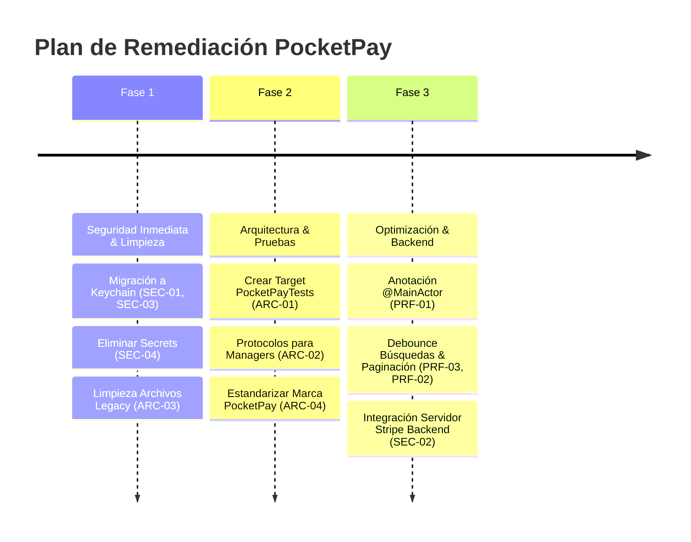

# 🛠️ Plan de Acción y Remediaciones Priorizadas — PocketPay

**Fecha:** 6 de Agosto, 2026  
**Objetivo:** Guía de ejecución priorizada paso a paso para resolver los hallazgos de auditoría en el repositorio **PocketPay**.

---

## 🎯 Mapa de Ruta por Fases (Roadmap)

---

## 📋 Fase 1: Correcciones Críticas de Seguridad y Limpieza (COMPLETADA ✅)

### Task 1.1: Migrar Persistencia de `User` y `PaymentMethod` a Keychain (COMPLETADO ✅)
- **Estado:** ✅ Completado. `KeychainManager.swift` encapsula `SecItemAdd`, `SecItemCopyMatching` y `SecItemDelete`. `User.save()`, `User.load()`, `PaymentMethod.saveAll()`, `PaymentMethod.loadAll()` operan exclusivamente sobre Keychain.
- **Archivos Afiliados:** 
  - [`PocketPay/Core/KeychainManager.swift`](file:///Users/eduardotorres/Developer/XCodes/PocketPay/PocketPay/Core/KeychainManager.swift)
  - [`PocketPay/Model/User.swift`](file:///Users/eduardotorres/Developer/XCodes/PocketPay/PocketPay/Model/User.swift)
  - [`PocketPay/Model/PaymentMethod.swift`](file:///Users/eduardotorres/Developer/XCodes/PocketPay/PocketPay/Model/PaymentMethod.swift)

### Task 1.2: Eliminar `stripeSecretKey` de Código Cliente (COMPLETADO ✅)
- **Estado:** ✅ Completado. La variable `stripeSecretKey` fue completamente eliminada de [`APIKeys.swift`](file:///Users/eduardotorres/Developer/XCodes/PocketPay/PocketPay/Config/APIKeys.swift).

### Task 1.3: Eliminar Archivos Obsoletos / Huérfanos (COMPLETADO ✅)
- **Estado:** ✅ Completado. Se eliminaron los archivos redundantes `PocketPay/PocketPayApp.swift` y `PocketPay/ContentView.swift`.

---

## 📐 Fase 2: Refactorización de Arquitectura y Pruebas (Corto Plazo)

### Task 2.1: Crear Target de Pruebas Unitarias (`PocketPayTests`)
- **Objetivo:** Cobertura de pruebas automatizadas para lógica financiera.
- **Paso a Paso:**
  1. En Xcode, añadir un nuevo Target de tipo **Unit Testing Bundle** (`PocketPayTests`).
  2. Implementar pruebas unitarias para:
     - `PaymentManager.sendMoney` (éxito, saldo insuficiente, monto cero).
     - `AuthManager.login` (autenticación válida/inválida).
     - `WalletViewModel.addPaymentMethod` (invariante de tarjeta por defecto única).

### Task 2.2: Introducir Protocolos para Inyección de Dependencias
- **Objetivo:** Desacoplar ViewModels de implementaciones concretas Singleton.
- **Paso a Paso:**
  1. Crear protocolo `PaymentProcessing` en `PaymentManager.swift`.
  2. Crear protocolo `AuthManaging` en `AuthManager.swift`.
  3. Actualizar los ViewModels para aceptar los protocolos en sus inicializadores con valores por defecto.

### Task 2.3: Estandarizar Naming (PocketPay)
- **Objetivo:** Coherencia de marca en todo el repositorio.
- **Paso a Paso:**
  1. Cambiar `AppConstants.AppInfo.name = "PRPay"` a `"PocketPay"`.
  2. Renombrar `PRPayApp.swift` a `PocketPayApp.swift`.
  3. Actualizar textos de UI de "PRPay" a "PocketPay".

---

## ⚡ Fase 3: Optimización de Concurrencia y Servidor (Mediano Plazo)

### Task 3.1: Refactorizar Concurrencia con `@MainActor`
- **Objetivo:** Eliminar dispatches repetitivos a `MainActor.run`.
- **Paso a Paso:**
  1. Anotar la declaración de clase de `PaymentManager`, `AuthManager` y ViewModels con `@MainActor`.
  2. Simplificar el cuerpo de los métodos asíncronos removiendo `await MainActor.run { ... }`.

### Task 3.2: Conexión Segura con Backend Backend (Stripe & JWT)
- **Objetivo:** Reemplazar mocks por servicios de producción.
- **Paso a Paso:**
  1. Implementar cliente HTTP REST (`URLSession`) para comunicarse con la API backend.
  2. Almacenar el JWT token en Keychain y adjuntarlo a las solicitudes HTTP de cobro.
