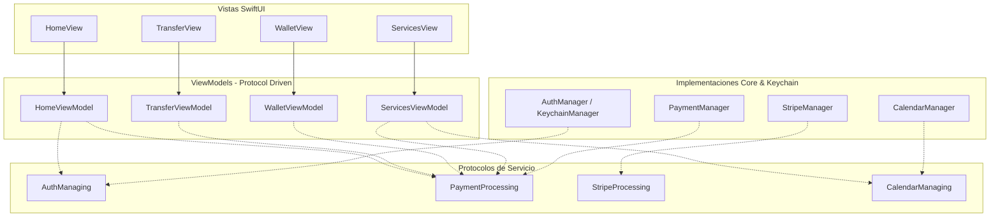

# 📐 Reporte de Auditoría de Arquitectura y Diseño — PocketPay

**Fecha:** 6 de Agosto, 2026  
**Auditor:** Code Reviewer & Security Auditor Agent (`code-reviewer-auditor`)  
**Alcance (Audit Scope):** Patrones MVVM, Inyección de Dependencias, Modularidad, Suite de Pruebas y Limpieza de Código

---

## 🏗️ Resumen de Hallazgos de Arquitectura

| ID | Severidad | Título / Área | Archivos Afectados | Estado |
| :--- | :---: | :--- | :--- | :---: |
| **ARC-01** | 🔴 CRÍTICO | Ausencia Total de Suite de Pruebas Unitarias y UI Tests | `PocketPay.xcodeproj` (Falta target de Tests) | PENDIENTE |
| **ARC-02** | 🟠 ALTO | Acoplamiento Severo a Singletons e Imposibilidad de Mocks | [`PocketPay/Core/PaymentManager.swift`](file:///Users/eduardotorres/Developer/XCodes/PocketPay/PocketPay/Core/PaymentManager.swift#L31-L36) | PENDIENTE |
| **ARC-03** | 🟠 ALTO | Archivos de Código Legacy / Redundantes en la Raíz del Proyecto | `PocketPay/PocketPayApp.swift`, `PocketPay/ContentView.swift` | **RESUELTO ✅ (Eliminados)** |
| **ARC-04** | 🟠 ALTO | Inconsistencia Identitaria de Marca y Naming (PocketPay vs PRPay) | [`PocketPay/Config/Constants.swift`](file:///Users/eduardotorres/Developer/XCodes/PocketPay/PocketPay/Config/Constants.swift#L96), [`PocketPay/App/PRPayApp.swift`](file:///Users/eduardotorres/Developer/XCodes/PocketPay/PocketPay/App/PRPayApp.swift) | PENDIENTE |
| **ARC-05** | 🟡 MEDIO | Mezcla de Estado de Presentación UI en ViewModels de Dominio | [`PocketPay/ViewModel/WalletViewModel.swift`](file:///Users/eduardotorres/Developer/XCodes/PocketPay/PocketPay/ViewModel/WalletViewModel.swift#L28) | PENDIENTE |
| **ARC-06** | 🟡 MEDIO | Ausencia de Manejo de Errores Estructurado (`AppError` Enum) | [`PocketPay/Core/StripeManager.swift`](file:///Users/eduardotorres/Developer/XCodes/PocketPay/PocketPay/Core/StripeManager.swift#L198) | PENDIENTE |
| **ARC-07** | 🟢 BAJO | Falta de Separación de Capa de Red (Network Abstraction Layer) | Global Core | PENDIENTE |

---

## 🏛️ Análisis Detallado de Arquitectura

### ARC-01: Ausencia Total de Suite de Pruebas Unitarias y UI Tests (🔴 CRÍTICO)

#### Diagnóstico
El proyecto Xcode `PocketPay.xcodeproj` no posee ningún target de pruebas (`PocketPayTests` o `PocketPayUITests`).

#### Impacto
- Las reglas de negocio financieras (validación de saldo suficiente, cálculo de comisiones, de-default de tarjetas) se prueban manualmente.
- No existe barrera contra regresiones silenciosas en pipelines de CI/CD al modificar los managers de pagos.

---

### ARC-02: Acoplamiento Severo a Singletons concretos (🟠 ALTO)

#### Diagnóstico
[`PaymentManager`](file:///Users/eduardotorres/Developer/XCodes/PocketPay/PocketPay/Core/PaymentManager.swift) y los ViewModels ([`HomeViewModel`](file:///Users/eduardotorres/Developer/XCodes/PocketPay/PocketPay/ViewModel/HomeViewModel.swift), [`TransferViewModel`](file:///Users/eduardotorres/Developer/XCodes/PocketPay/PocketPay/ViewModel/TransferViewModel.swift)) consumen directamente los Singletons `.shared`:

```swift
private let stripeManager = StripeManager.shared
private let authManager = AuthManager.shared
```

#### Refactorización Propuesta con Protocolos (Inyección de Dependencias)

```swift
// 1. Contrato
protocol PaymentProcessing {
    func sendMoney(to contact: Contact, amount: Double, notes: String?) async -> Bool
    func payBusiness(name: String, amount: Double, notes: String?) async -> Bool
}

// 2. Inyección
class TransferViewModel: ObservableObject {
    private let paymentManager: PaymentProcessing

    init(paymentManager: PaymentProcessing = PaymentManager.shared) {
        self.paymentManager = paymentManager
    }
}
```

---

### ARC-03: Archivos Redundantes / Huérfanos (🟠 ALTO — RESUELTO ✅)

#### Diagnóstico Previos vs Estado Actual
- **Previo:** Existían los archivos `PocketPay/PocketPayApp.swift` y `PocketPay/ContentView.swift` sin uso.
- **Estado Actual:** ✅ **Resuelto**. Ambos archivos fueron eliminados. [`PRPayApp.swift`](file:///Users/eduardotorres/Developer/XCodes/PocketPay/PocketPay/App/PRPayApp.swift) actúa como el único punto de entrada `@main`.

---

### ARC-04: Inconsistencia Identitaria y Naming (PocketPay vs PRPay) (🟠 ALTO)

#### Diagnóstico
- La carpeta del proyecto y repositorio se llama **PocketPay**.
- El punto de entrada se llama `PRPayApp.swift`.
- Las constantes especifican `AppConstants.AppInfo.name = "PRPay"`.
- Los logs y títulos de botones mencionan "PRPay" en lugar de "PocketPay".

#### Acción Recomendada
Estandarizar todo el código bajo la marca única **PocketPay**:
1. Renombrar `PRPayApp.swift` a `PocketPayApp.swift`.
2. Actualizar `AppConstants.AppInfo.name = "PocketPay"`.

---

## 🎨 Diagrama de Arquitectura Objetivo


